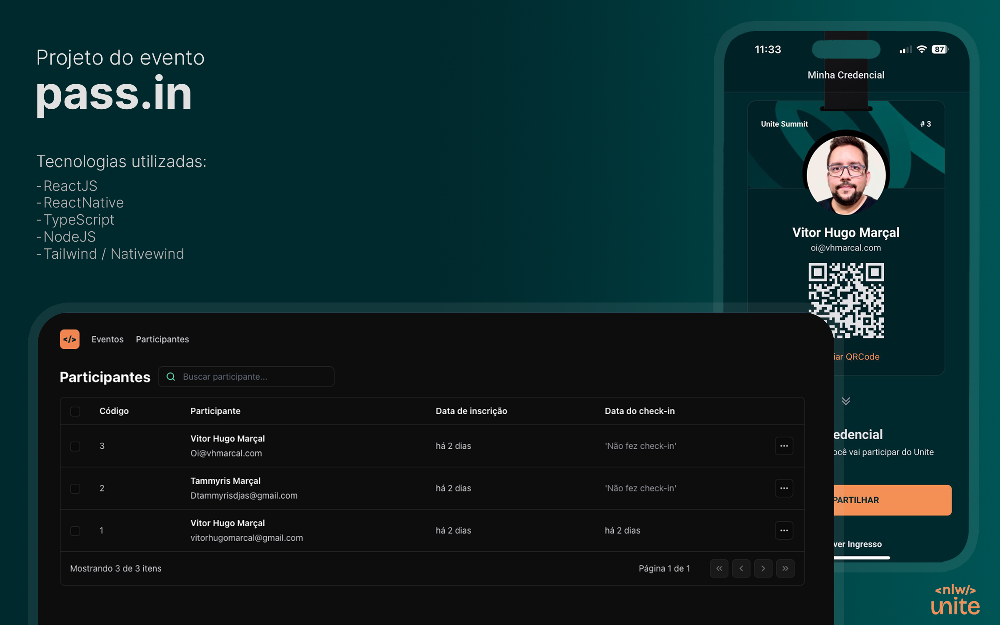

<h1 align="center"> pass.in </h1>

NLW event promoted by Rocketseat. 

  <a href="#-tecnologias">Technologies</a>&nbsp;&nbsp;&nbsp;|&nbsp;&nbsp;&nbsp;
  <a href="#-projeto">Project</a>&nbsp;&nbsp;&nbsp;|&nbsp;&nbsp;&nbsp;
  <a href="#-layout">Layout</a>&nbsp;&nbsp;&nbsp;|&nbsp;&nbsp;&nbsp;
  <a href="#memo-licença">License</a>

  

 

  

## 🚀 Technologies

This project was developed with the following technologies:
- React Native
- React JS
- Nativewind / Tailwind
- TypeScript
- NodeJS

## 💻 Project

Introducing our latest project developed during NLW Unite! 🚀 Presenting Pass.in, The Attendee Credential Management App.

## :memo: License

This project is under the MIT license.

---

Feito com ♥ by VHMarcal :wave:
